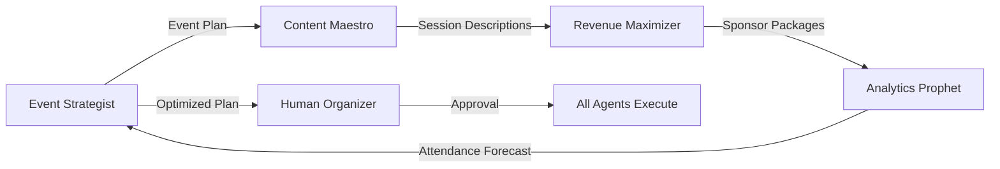
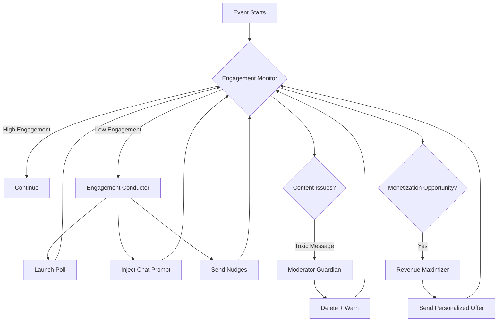

# Autonomous Agent Integration Vision
## Revolutionizing Event Management Through Intelligent Automation

**Document Version:** 1.0
**Date:** December 30, 2025
**Status:** Strategic Vision & Implementation Roadmap

---

## Executive Summary

This document outlines a transformative vision for integrating autonomous AI agents into our event management platform, creating the world's first **fully intelligent, self-optimizing event ecosystem**. By combining our sophisticated event sourcing architecture, real-time WebSocket infrastructure, and comprehensive feature set with cutting-edge agentic workflows, we will create an **Event Intelligence Operating System (EIOS)** that handles planning, execution, monitoring, and continuous improvement autonomously.

**Key Differentiator:** While competitors offer basic automation, we're building **proactive, context-aware agents** that don't just execute tasks—they anticipate needs, make intelligent decisions, collaborate with each other, and continuously learn from every event to deliver exponentially better outcomes.

---

## Table of Contents

1. [Strategic Positioning](#strategic-positioning)
2. [The Agent Architecture](#the-agent-architecture)
3. [Core Agent Personas](#core-agent-personas)
4. [Agent Workflows & Orchestration](#agent-workflows--orchestration)
5. [Technical Integration](#technical-integration)
6. [Real-Time Intelligence Layer](#real-time-intelligence-layer)
7. [Implementation Phases](#implementation-phases)
8. [Competitive Advantages](#competitive-advantages)
9. [Future Vision](#future-vision)

---

## Strategic Positioning

### The Problem We're Solving

Current event management platforms are **reactive tools** requiring constant human intervention:
- Manual content creation and scheduling
- Reactive problem-solving during events
- Post-event analysis that arrives too late
- No predictive intelligence or optimization
- Siloed data with no cross-event learning
- Human bottlenecks in scaling operations

### Our Revolutionary Approach

We're building an **Autonomous Event Intelligence Operating System** where AI agents:
- **Plan events** based on goals, audience, and historical data
- **Monitor in real-time** and intervene before problems occur
- **Optimize continuously** using live data and A/B testing
- **Learn collectively** across all events on the platform
- **Collaborate** with each other and humans seamlessly
- **Scale infinitely** without additional human resources

### Why We'll Win

1. **Event Sourcing Foundation**: Our event-sourced architecture provides a complete audit trail and time-travel capabilities—perfect for ML training
2. **Real-Time Infrastructure**: 20+ WebSocket gateways enable agents to act in real-time across all event touchpoints
3. **Rich Context**: Gamification, networking, monetization, and engagement data create a comprehensive behavioral graph
4. **Multi-Modal Capabilities**: Chat, polls, Q&A, reactions, proximity, presentations—agents can influence every attendee interaction
5. **Network Effects**: Every event improves the AI for all future events on the platform

---

## The Agent Architecture

### Core Principles

1. **Multi-Agent System (MAS)**: Specialized agents with defined responsibilities that collaborate
2. **Event-Driven**: Agents react to domain events from our event sourcing system
3. **Context-Aware**: Agents maintain state and understand the full event context
4. **Goal-Oriented**: Each agent has measurable objectives aligned with event success
5. **Human-in-the-Loop**: Agents augment, not replace, human organizers—with progressive autonomy

### Agent Stack

```
┌─────────────────────────────────────────────────────────────────┐
│                    ORCHESTRATOR LAYER                            │
│  (Multi-Agent Coordinator + Task Planner + Conflict Resolution)  │
└────────────────────────┬────────────────────────────────────────┘
                         │
         ┌───────────────┼───────────────┐
         │               │               │
┌────────▼────────┐ ┌───▼──────────┐ ┌─▼──────────────┐
│  PLANNING       │ │  EXECUTION    │ │  OPTIMIZATION  │
│  AGENTS         │ │  AGENTS       │ │  AGENTS        │
│                 │ │               │ │                │
│ • Strategist    │ │ • Moderator   │ │ • Optimizer    │
│ • Content Gen   │ │ • Engagement  │ │ • Analyst      │
│ • Scheduler     │ │ • Support     │ │ • Predictor    │
└────────┬────────┘ └───┬──────────┘ └─┬──────────────┘
         │              │              │
         └──────────────┼──────────────┘
                        │
┌───────────────────────▼──────────────────────────────────┐
│              INTELLIGENCE SUBSTRATE                       │
│  • Event Sourcing Store (Complete History)               │
│  • Vector Database (Embeddings & Semantic Search)        │
│  • Real-Time State (Redis)                               │
│  • Knowledge Graph (Entities & Relationships)            │
│  • ML Models (Classification, Prediction, Generation)    │
└───────────────────────┬──────────────────────────────────┘
                        │
┌───────────────────────▼──────────────────────────────────┐
│              INTEGRATION LAYER                            │
│  • Event Bus (Redis Pub/Sub)                             │
│  • WebSocket Gateways (20+ channels)                     │
│  • GraphQL/REST APIs                                      │
│  • External Services (Stripe, LLMs, Analytics)           │
└───────────────────────────────────────────────────────────┘
```

---

## Core Agent Personas

### 1. The Event Strategist Agent

**Role:** End-to-end event planning and blueprint creation

**Capabilities:**
- Analyzes event goals, target audience, and budget
- Recommends optimal event structure (duration, session count, tracks)
- Suggests speakers based on expertise matching and availability
- Proposes venues using location analytics and capacity optimization
- Creates detailed timelines and dependencies
- Generates event blueprints for similar future events

**Intelligence Sources:**
- Historical event performance data
- Industry benchmarks and trends
- Audience demographics and preferences
- Speaker success metrics (ratings, engagement)
- Venue utilization patterns

**Actions:**
```typescript
// Example: Creating an event from high-level goals
POST /api/agents/strategist/plan-event
{
  "goals": {
    "type": "conference",
    "attendeeTarget": 500,
    "budget": 100000,
    "objectives": ["thought leadership", "lead generation", "networking"],
    "duration": "2 days"
  },
  "constraints": {
    "dates": ["2025-06-15 to 2025-06-16"],
    "location": "San Francisco Bay Area",
    "restrictions": []
  }
}

// Agent returns comprehensive plan with confidence scores
{
  "eventBlueprint": {
    "name": "AI Innovation Summit 2025",
    "structure": {
      "days": 2,
      "tracks": 3,
      "sessions": 24,
      "keynotes": 4,
      "workshops": 8,
      "networking": 5
    },
    "suggestedSpeakers": [
      { "id": "...", "name": "Dr. Jane Doe", "topic": "LLM Safety", "confidence": 0.92 }
    ],
    "suggestedVenues": [
      { "id": "...", "name": "Moscone Center", "capacity": 600, "cost": 45000, "score": 0.88 }
    ],
    "timeline": [...],
    "projectedOutcomes": {
      "attendance": { "expected": 485, "range": [420, 520] },
      "engagement": { "score": 0.78 },
      "revenue": { "tickets": 75000, "sponsors": 30000 }
    }
  }
}
```

**Integration Points:**
- Event Blueprints API
- Speaker availability search
- Venue booking system
- Budget allocation

---

### 2. The Content Maestro Agent

**Role:** Automated content creation across all event touchpoints

**Capabilities:**
- Generates session descriptions optimized for SEO and engagement
- Creates social media content (pre-event, during, post-event)
- Writes personalized email campaigns (invitations, reminders, follow-ups)
- Drafts presentation outlines for speakers based on session goals
- Generates poll questions aligned with session topics
- Creates Q&A discussion starters
- Produces post-event reports and analytics summaries

**Intelligence Sources:**
- Event goals and branding guidelines
- Session topics and speaker bios
- Attendee profiles and interests
- Engagement metrics from past content
- Industry content trends

**Actions:**
```graphql
# GraphQL mutation for content generation
mutation GenerateSessionContent {
  agentContentGenerate(
    sessionId: "session-uuid"
    contentTypes: [DESCRIPTION, POLLS, QNA_STARTERS, SOCIAL_POSTS]
    tone: PROFESSIONAL
    targetAudience: TECHNICAL_PROFESSIONALS
  ) {
    description
    polls {
      question
      options
      type
    }
    qnaStarters
    socialPosts {
      platform
      content
      scheduledTime
    }
  }
}
```

**Integration Points:**
- Session management API
- Chat/Polls/Q&A gateways
- Email service
- Social media APIs

---

### 3. The Engagement Conductor Agent

**Role:** Real-time attendee engagement and experience optimization

**Capabilities:**
- Monitors engagement metrics (chat activity, poll participation, reactions)
- Triggers interventions when engagement drops below thresholds
- Launches polls at optimal moments based on session flow
- Injects discussion prompts into chat during lulls
- Surfaces trending topics from chat to speakers/moderators
- Sends personalized nudges to disengaged attendees
- Orchestrates gamification (achievements, leaderboards, challenges)
- Manages dynamic breakout room assignments

**Intelligence Sources:**
- Real-time WebSocket events (chat, reactions, presence)
- Attention analytics (time spent, interactions)
- Historical engagement patterns
- Speaker pacing and slide transitions
- Audio sentiment analysis (future)

**Actions:**
```typescript
// Real-time agent decision via WebSocket
// Agent subscribes to session:{sessionId}:analytics

// When engagement score drops below 0.6:
agentActions.triggerPoll({
  sessionId: 'session-123',
  question: 'Which AI technique are you most interested in?',
  options: ['RAG', 'Fine-tuning', 'Prompt Engineering', 'Agents'],
  reason: 'LOW_ENGAGEMENT_INTERVENTION',
  timing: 'IMMEDIATE'
});

// Agent broadcasts via chat gateway
socket.to(`session:${sessionId}`).emit('chat.message.new', {
  type: 'AGENT_MESSAGE',
  content: '💡 Quick question: What challenges are you facing with AI adoption?',
  agentName: 'Engagement Conductor',
  isPinned: true
});
```

**Integration Points:**
- Chat, Polls, Q&A gateways
- Gamification service
- Reactions gateway
- Analytics dashboard

---

### 4. The Moderator Guardian Agent

**Role:** Automated content moderation and community management

**Capabilities:**
- Detects toxic, spam, or inappropriate chat messages
- Identifies questions needing escalation in Q&A
- Flags duplicate or low-quality poll submissions
- Surfaces high-value questions to speakers
- Auto-responds to common attendee queries (FAQ bot)
- Manages waitlists and spot allocation intelligently
- Detects and prevents fraudulent activity (ticket scalping, fake registrations)

**Intelligence Sources:**
- Message sentiment and toxicity models
- Historical moderation decisions
- Community guidelines and rules
- Attendee reputation scores
- Behavioral anomaly detection

**Actions:**
```typescript
// Agent subscribes to all chat messages via event bus
eventBus.on('chat.message.new', async (message) => {
  const analysis = await moderatorAgent.analyze(message);

  if (analysis.toxicity > 0.8) {
    // Auto-delete and warn user
    await chatService.deleteMessage(message.id, 'AUTOMATED_MODERATION');
    await notificationService.sendWarning(message.userId, {
      reason: 'TOXIC_CONTENT',
      guidelines: 'community-guidelines-url'
    });
  } else if (analysis.isQuestion && analysis.quality > 0.7) {
    // Surface to Q&A and notify speaker
    await qnaService.createQuestion(message.content, message.userId);
    await notificationService.notifySpeaker(sessionId, {
      type: 'HIGH_QUALITY_QUESTION',
      content: message.content
    });
  }
});
```

**Integration Points:**
- Chat gateway
- Q&A gateway
- Notification system
- User management

---

### 5. The Revenue Maximizer Agent

**Role:** Intelligent monetization and upsell optimization

**Capabilities:**
- Determines optimal timing for offer presentation
- Personalizes offer recommendations based on user behavior
- Dynamically adjusts pricing based on demand (dynamic pricing)
- Optimizes ad placement and rotation for maximum CTR
- Manages waitlist promotions with conversion optimization
- A/B tests offer copy, pricing, and placement
- Predicts purchase intent and preemptively offers incentives
- Identifies high-value attendees for VIP upsells

**Intelligence Sources:**
- Purchase history and patterns
- Engagement and session attendance
- Demographic and firmographic data
- Price elasticity models
- Competitor pricing intelligence

**Actions:**
```typescript
// Agent monitors user behavior via real-time events
const userProfile = await agent.buildProfile(userId);

// Predict purchase intent
const intent = await agent.predictPurchaseIntent(userProfile, eventId);

if (intent.probability > 0.75 && userProfile.lifetimeValue > 500) {
  // Send personalized VIP upgrade offer
  await offerService.createPersonalizedOffer({
    userId,
    offerType: 'VIP_UPGRADE',
    discount: agent.calculateOptimalDiscount(userProfile), // e.g., 15%
    expiresIn: '24h',
    placement: 'POST_SESSION_EMAIL',
    reason: 'HIGH_INTENT_DETECTED'
  });

  // Track in experimentation framework
  await abTestService.trackVariant('vip-offer-timing-v3', userId);
}

// For ads: Use reinforcement learning for placement
const adPlacement = await agent.selectOptimalAd({
  sessionId,
  userId,
  context: 'SESSION_BREAK',
  availableAds: [...],
  objective: 'MAXIMIZE_CTR'
});
```

**Integration Points:**
- Offers API
- Ads serving gateway
- Stripe webhooks
- A/B testing framework

---

### 6. The Network Weaver Agent

**Role:** Intelligent attendee matchmaking and networking facilitation

**Capabilities:**
- Analyzes attendee profiles to identify compatible connections
- Suggests networking circle memberships based on interests
- Facilitates introductions via DM with personalized ice-breakers
- Creates dynamic proximity-based meetup suggestions
- Identifies "connector" attendees who bridge communities
- Optimizes breakout room assignments for diversity and value
- Triggers post-event follow-up introductions

**Intelligence Sources:**
- Attendee profiles (job title, interests, goals)
- Session attendance patterns
- Chat and Q&A interactions
- Proximity data (for in-person events)
- LinkedIn/social graph data
- Historical networking success metrics

**Actions:**
```typescript
// Agent analyzes attendee graph
const networkGraph = await agent.buildNetworkGraph(eventId);

// Find optimal connections
const recommendations = await agent.findConnections(userId, {
  criteria: ['SHARED_INTERESTS', 'COMPLEMENTARY_SKILLS', 'MUTUAL_BENEFIT'],
  limit: 5
});

for (const match of recommendations) {
  // Send personalized DM via DM gateway
  await dmService.sendAgentMessage({
    recipientId: userId,
    content: `👋 Hi ${user.firstName}! I noticed you're interested in ${match.sharedInterest}. You might want to connect with ${match.name} (${match.title}). They're working on similar challenges. Would you like an introduction?`,
    actions: [
      { label: 'Yes, introduce us!', action: 'ACCEPT_INTRO' },
      { label: 'Maybe later', action: 'DEFER' }
    ]
  });
}

// For in-person: Proximity-based suggestions
eventBus.on('proximity.nearby', async ({ userId, nearbyUsers }) => {
  const compatibleUsers = await agent.filterCompatibleNearby(userId, nearbyUsers);
  if (compatibleUsers.length > 0) {
    await notificationService.push(userId, {
      title: '🤝 Someone interesting is nearby!',
      body: `${compatibleUsers[0].name} is within 50ft. Say hi!`
    });
  }
});
```

**Integration Points:**
- Networking module (circles, proximity, suggestions)
- DM gateway
- Profile service
- Notification system

---

### 7. The Performance Optimizer Agent

**Role:** Continuous A/B testing and data-driven optimization

**Capabilities:**
- Runs multi-armed bandit experiments across all features
- Tests session timings, speaker orders, break durations
- Optimizes notification timing and content
- Experiments with gamification reward structures
- Tests pricing strategies and discount levels
- Measures causal impact of interventions
- Automatically rolls out winning variants

**Intelligence Sources:**
- Real-time engagement metrics
- Revenue and conversion data
- Attendee feedback and NPS
- Historical experiment results
- Statistical models (Bayesian optimization)

**Actions:**
```typescript
// Agent defines experiment
const experiment = await optimizer.createExperiment({
  name: 'Poll Timing Optimization',
  hypothesis: 'Polls launched at 60% session progress yield higher engagement',
  variants: [
    { name: 'Early', timing: '30%' },
    { name: 'Mid', timing: '60%' },
    { name: 'Late', timing: '80%' }
  ],
  metric: 'poll_participation_rate',
  duration: '10 sessions',
  allocation: 'THOMPSON_SAMPLING' // Adaptive allocation
});

// Agent monitors experiment progress
setInterval(async () => {
  const results = await optimizer.checkExperiment(experiment.id);

  if (results.confidence > 0.95) {
    // Winner found - auto-rollout
    await optimizer.rolloutWinner(experiment.id);
    logger.info(`Experiment ${experiment.name} concluded. Winner: ${results.winner}`);
  }
}, 60000); // Check every minute
```

**Integration Points:**
- Analytics service
- Feature flag system
- All agent actions (wrapped in experiments)

---

### 8. The Crisis Manager Agent

**Role:** Proactive incident detection and resolution

**Capabilities:**
- Monitors system health (latency, errors, capacity)
- Detects anomalies in attendee behavior (mass exits, complaint clusters)
- Identifies speaker issues (audio problems, late arrivals)
- Predicts and prevents capacity overflows
- Auto-scales infrastructure based on demand
- Triggers contingency plans for common issues
- Escalates critical issues to human operators

**Intelligence Sources:**
- Health monitoring metrics
- Error logs and stack traces
- Attendee sentiment analysis
- Historical incident patterns
- Infrastructure telemetry

**Actions:**
```typescript
// Agent monitors health metrics
healthMonitor.on('anomaly', async (anomaly) => {
  if (anomaly.type === 'MASS_EXIT') {
    // Detect attendees leaving session en masse
    const sessionId = anomaly.sessionId;
    const exitRate = anomaly.metric.value;

    if (exitRate > 0.3) { // 30% exit rate
      // Trigger investigation
      const analysis = await agent.investigateMassExit(sessionId);

      if (analysis.likelyCause === 'AUDIO_ISSUES') {
        // Auto-remediate: Notify speaker and tech support
        await notificationService.alertSpeaker(sessionId, {
          severity: 'CRITICAL',
          issue: 'AUDIO_QUALITY_DEGRADED',
          suggestion: 'Check microphone connection or switch to backup audio'
        });

        await incidentService.createTicket({
          priority: 'P0',
          type: 'AUDIO_FAILURE',
          sessionId,
          assignee: 'tech-support-team'
        });
      }

      // Send retention message to remaining attendees
      await chatService.broadcastAgentMessage(sessionId, {
        content: '⚠️ We\'re aware of the audio issues and working to fix them. Thank you for your patience!',
        priority: 'HIGH'
      });
    }
  }
});
```

**Integration Points:**
- Health gateway
- Incident management system
- Infrastructure APIs (scaling, failover)
- Notification system

---

### 9. The Analytics Prophet Agent

**Role:** Predictive analytics and business intelligence

**Capabilities:**
- Forecasts event attendance and revenue
- Predicts session popularity and capacity needs
- Identifies at-risk attendees (likely to drop out)
- Forecasts sponsor ROI and ad performance
- Predicts optimal pricing strategies
- Generates automated insights and recommendations
- Creates executive dashboards and reports

**Intelligence Sources:**
- Historical event data (1000s of events)
- Registration funnel metrics
- Marketing campaign performance
- External signals (seasonality, competitors, economy)
- Time-series models (ARIMA, Prophet)

**Actions:**
```typescript
// Generate event forecast
const forecast = await prophet.forecastEvent(eventId, {
  horizon: '30 days',
  metrics: ['REGISTRATIONS', 'REVENUE', 'ENGAGEMENT'],
  confidence: 0.9
});

// Auto-generate insights
const insights = await prophet.generateInsights(eventId);

// Example insight
{
  type: 'OPPORTUNITY',
  severity: 'MEDIUM',
  title: 'Untapped VIP Revenue Potential',
  description: 'Based on attendee profiles, 23% of current General ticket holders match the VIP buyer persona. Estimated conversion rate: 15%.',
  recommendation: 'Launch targeted VIP upgrade campaign to this segment.',
  impact: {
    revenue: { expected: 18500, range: [12000, 25000] },
    confidence: 0.82
  },
  action: {
    type: 'CAMPAIGN',
    template: 'vip-upgrade-v2',
    targetSegment: 'vip-lookalike'
  }
}

// Agent can auto-execute approved insights
if (insights.some(i => i.confidence > 0.9 && i.type === 'OPPORTUNITY')) {
  await agent.executeInsight(insight.action);
}
```

**Integration Points:**
- Analytics database
- Reporting service
- Forecasting models
- Dashboard APIs

---

### 10. The Learning Librarian Agent

**Role:** Knowledge management and cross-event learning

**Capabilities:**
- Builds a knowledge graph of all events, speakers, sessions, attendees
- Identifies patterns and best practices across events
- Creates reusable playbooks and templates
- Maintains a vector database of successful content
- Provides semantic search across all event data
- Transfers learnings between similar events
- Documents agent decisions for auditability

**Intelligence Sources:**
- Event sourcing store (complete history)
- Session recordings and transcripts
- Attendee feedback and surveys
- Agent action logs and outcomes
- External knowledge sources

**Actions:**
```typescript
// Query the knowledge graph
const similarEvents = await librarian.findSimilarEvents(eventId, {
  similarity: ['AUDIENCE', 'GOALS', 'FORMAT'],
  limit: 5
});

// Extract learnings
const learnings = await librarian.extractLearnings(similarEvents);

// Apply to current event
for (const learning of learnings) {
  if (learning.confidence > 0.8 && learning.applicability === 'HIGH') {
    await agent.applyLearning(eventId, learning);
    logger.info(`Applied learning: ${learning.title}`);
  }
}

// Example: Semantic search for content reuse
const query = 'engaging poll questions about AI ethics';
const results = await librarian.semanticSearch(query, {
  type: 'POLLS',
  minQuality: 0.7,
  limit: 10
});

// Suggest to Content Maestro agent
await contentAgent.suggestReuse(results);
```

**Integration Points:**
- Event sourcing store
- Vector database (Pinecone, Weaviate)
- Knowledge graph (Neo4j)
- All other agents (shared knowledge)

---

## Agent Workflows & Orchestration

### Multi-Agent Collaboration Patterns

#### 1. Pre-Event Planning Workflow



**Example Flow:**
1. **Event Strategist** creates initial event blueprint
2. **Content Maestro** generates all session descriptions and marketing copy
3. **Revenue Maximizer** designs sponsor packages and pricing
4. **Analytics Prophet** forecasts attendance and revenue
5. **Event Strategist** refines plan based on forecast
6. Human organizer reviews and approves
7. All agents execute their tasks autonomously

---

#### 2. Real-Time Event Execution Workflow



**Real-Time Decision Making:**
- Agents monitor live WebSocket events
- React within milliseconds to engagement drops
- Collaborate to solve problems (e.g., Moderator + Engagement Conductor)
- All actions logged in event sourcing store for learning

---

#### 3. Post-Event Learning Workflow

```typescript
// After event completion
const postEventWorkflow = async (eventId: string) => {
  // 1. Analytics Prophet generates performance report
  const report = await prophet.analyzeEventPerformance(eventId);

  // 2. Learning Librarian extracts insights
  const insights = await librarian.extractInsights(eventId, report);

  // 3. Update knowledge graph
  await librarian.updateKnowledgeGraph(insights);

  // 4. Event Strategist updates blueprints
  if (report.success_score > 0.8) {
    await strategist.createBlueprintFromEvent(eventId);
  }

  // 5. All agents update their models
  await Promise.all([
    contentAgent.retrainModels(eventId),
    engagementAgent.updateThresholds(report.engagement_metrics),
    revenueAgent.updatePricingModels(report.revenue_data),
    optimizerAgent.concludeExperiments(eventId)
  ]);

  // 6. Generate recommendations for next event
  const recommendations = await strategist.generateRecommendations(
    eventId,
    insights
  );

  // 7. Notify organizer
  await notificationService.sendReport(organizerId, {
    report,
    insights,
    recommendations
  });
};
```

---

### Agent Communication Protocol

Agents communicate via an **event-driven message bus** (Redis Pub/Sub):

```typescript
// Agent publishes intent
agentBus.publish('agent.intent', {
  agentId: 'engagement-conductor-1',
  action: 'LAUNCH_POLL',
  sessionId: 'session-123',
  payload: {
    question: 'How are you finding this session?',
    options: ['Great', 'Good', 'OK', 'Not helpful']
  },
  priority: 'HIGH',
  reason: 'LOW_ENGAGEMENT_DETECTED'
});

// Orchestrator reviews and approves
orchestrator.on('agent.intent', async (intent) => {
  // Check for conflicts with other agents
  const conflicts = await orchestrator.detectConflicts(intent);

  if (conflicts.length === 0) {
    // Approve and execute
    await orchestrator.approve(intent);
    await executeAction(intent);
  } else {
    // Resolve conflict (e.g., two agents want to send different polls)
    const resolution = await orchestrator.resolveConflict(conflicts);
    await executeAction(resolution);
  }
});
```

---

## Technical Integration

### Integration with Existing Architecture

#### 1. Event Sourcing Integration

Agents consume domain events from the event store:

```python
# event-lifecycle-service/app/agents/event_consumer.py

from app.core.events import EventBus
from app.agents.strategist import EventStrategistAgent

event_bus = EventBus()
strategist = EventStrategistAgent()

@event_bus.subscribe('EventCreated')
async def on_event_created(event: DomainEvent):
    """Strategist agent analyzes new event and provides recommendations."""
    event_id = event.data['event_id']

    # Agent analyzes event
    analysis = await strategist.analyze_event(event_id)

    # Provide recommendations to organizer
    await notification_service.send_to_organizer(event.user_id, {
        'type': 'AGENT_RECOMMENDATIONS',
        'analysis': analysis,
        'suggestions': analysis.suggestions
    })

@event_bus.subscribe('SessionUpdated')
async def on_session_updated(event: DomainEvent):
    """Multiple agents react to session changes."""
    session_id = event.data['session_id']

    # Content Maestro regenerates descriptions if topic changed
    if 'title' in event.data.get('changes', {}):
        await content_agent.regenerate_content(session_id)

    # Analytics Prophet updates forecasts
    await prophet.update_session_forecast(session_id)
```

#### 2. Real-Time Gateway Integration

Agents interact with WebSocket gateways:

```typescript
// real-time-service/src/agents/engagement-agent.service.ts

import { Injectable } from '@nestjs/common';
import { Server } from 'socket.io';

@Injectable()
export class EngagementAgentService {
  constructor(
    @InjectWebSocketServer() private server: Server,
    private chatGateway: ChatGateway,
    private pollsGateway: PollsGateway,
    private analyticsService: AnalyticsService
  ) {}

  async monitorSession(sessionId: string) {
    // Subscribe to engagement metrics
    const metrics$ = this.analyticsService.getSessionMetrics$(sessionId);

    metrics$.subscribe(async (metrics) => {
      if (metrics.engagementScore < 0.6) {
        // Low engagement - intervene
        await this.intervene(sessionId, metrics);
      }
    });
  }

  private async intervene(sessionId: string, metrics: any) {
    // Decide intervention type based on context
    const intervention = await this.decideIntervention(sessionId, metrics);

    switch (intervention.type) {
      case 'POLL':
        await this.pollsGateway.createAgentPoll(sessionId, intervention.poll);
        break;
      case 'CHAT_PROMPT':
        await this.chatGateway.sendAgentMessage(sessionId, intervention.message);
        break;
      case 'NOTIFICATION':
        await this.sendDisengagementNudges(sessionId, intervention.targetUsers);
        break;
    }

    // Log action for learning
    await this.logIntervention(sessionId, intervention, metrics);
  }
}
```

#### 3. GraphQL API for Agent Operations

```python
# event-lifecycle-service/app/graphql/agent_types.py

import strawberry
from typing import List, Optional

@strawberry.type
class AgentRecommendation:
    agent_name: str
    recommendation_type: str
    title: str
    description: str
    confidence: float
    impact: Optional[dict]
    action: Optional[dict]

@strawberry.type
class AgentAnalysis:
    event_id: str
    analyzed_at: datetime
    recommendations: List[AgentRecommendation]
    forecast: Optional[dict]
    insights: List[str]

@strawberry.type
class Query:
    @strawberry.field
    async def agent_event_analysis(self, event_id: str) -> AgentAnalysis:
        """Get AI agent analysis and recommendations for an event."""
        return await agent_service.analyze_event(event_id)

    @strawberry.field
    async def agent_real_time_insights(self, session_id: str) -> List[str]:
        """Get real-time insights from agents during a live session."""
        return await agent_service.get_live_insights(session_id)

@strawberry.type
class Mutation:
    @strawberry.mutation
    async def enable_agent_autopilot(
        self,
        event_id: str,
        agents: List[str],
        approval_mode: str = 'MANUAL'
    ) -> bool:
        """Enable autopilot mode for selected agents."""
        return await agent_service.enable_autopilot(event_id, agents, approval_mode)
```

---

### New Infrastructure Components

#### 1. Agent Orchestration Service (Python/FastAPI)

```
event-management-platform/
├── agent-service/
│   ├── app/
│   │   ├── agents/
│   │   │   ├── strategist/
│   │   │   ├── content_maestro/
│   │   │   ├── engagement_conductor/
│   │   │   ├── moderator_guardian/
│   │   │   ├── revenue_maximizer/
│   │   │   ├── network_weaver/
│   │   │   ├── optimizer/
│   │   │   ├── crisis_manager/
│   │   │   ├── analytics_prophet/
│   │   │   └── learning_librarian/
│   │   ├── orchestrator/
│   │   │   ├── coordinator.py
│   │   │   ├── conflict_resolver.py
│   │   │   └── task_planner.py
│   │   ├── intelligence/
│   │   │   ├── vector_store.py
│   │   │   ├── knowledge_graph.py
│   │   │   ├── ml_models/
│   │   │   └── embeddings.py
│   │   ├── api/
│   │   │   ├── v1/
│   │   │   │   ├── agents.py
│   │   │   │   ├── orchestration.py
│   │   │   │   └── insights.py
│   │   └── integrations/
│   │       ├── event_lifecycle.py
│   │       ├── real_time.py
│   │       └── external_llms.py
│   ├── models/  # ML model artifacts
│   ├── requirements.txt
│   └── Dockerfile
```

#### 2. Vector Database for Semantic Search

```yaml
# docker-compose.yml addition
services:
  weaviate:
    image: semitechnologies/weaviate:latest
    environment:
      QUERY_DEFAULTS_LIMIT: 25
      AUTHENTICATION_APIKEY_ENABLED: 'true'
      PERSISTENCE_DATA_PATH: '/var/lib/weaviate'
      ENABLE_MODULES: 'text2vec-openai'
    volumes:
      - weaviate_data:/var/lib/weaviate
    ports:
      - "8080:8080"
```

#### 3. Knowledge Graph Database

```yaml
services:
  neo4j:
    image: neo4j:5-enterprise
    environment:
      NEO4J_AUTH: neo4j/your-password
      NEO4J_PLUGINS: '["apoc", "graph-data-science"]'
    volumes:
      - neo4j_data:/data
    ports:
      - "7474:7474"  # HTTP
      - "7687:7687"  # Bolt
```

#### 4. Message Queue for Agent Communication

```yaml
services:
  rabbitmq:
    image: rabbitmq:3-management
    environment:
      RABBITMQ_DEFAULT_USER: agent_system
      RABBITMQ_DEFAULT_PASS: ${RABBITMQ_PASSWORD}
    ports:
      - "5672:5672"   # AMQP
      - "15672:15672" # Management UI
```

---

## Real-Time Intelligence Layer

### Streaming Analytics Pipeline

```typescript
// real-time-service/src/intelligence/streaming-analytics.service.ts

import { Injectable } from '@nestjs/common';
import { RedisService } from './redis.service';
import { Observable, interval } from 'rxjs';
import { map, filter, bufferTime } from 'rxjs/operators';

@Injectable()
export class StreamingAnalyticsService {
  constructor(private redis: RedisService) {}

  /**
   * Real-time engagement score calculation
   */
  getEngagementScore$(sessionId: string): Observable<number> {
    return interval(5000).pipe( // Calculate every 5 seconds
      map(async () => {
        const [chatMessages, pollVotes, reactions, activeUsers] = await Promise.all([
          this.redis.get(`session:${sessionId}:chat:count:5m`),
          this.redis.get(`session:${sessionId}:polls:count:5m`),
          this.redis.get(`session:${sessionId}:reactions:count:5m`),
          this.redis.scard(`session:${sessionId}:active_users`)
        ]);

        // Weighted engagement formula
        const score = (
          (chatMessages * 0.3) +
          (pollVotes * 0.4) +
          (reactions * 0.2) +
          (activeUsers * 0.1)
        ) / 100; // Normalize to 0-1

        return Math.min(score, 1);
      })
    );
  }

  /**
   * Anomaly detection stream
   */
  detectAnomalies$(sessionId: string): Observable<Anomaly> {
    return this.getEngagementScore$(sessionId).pipe(
      bufferTime(60000), // Look at 1-minute window
      map((scores) => {
        const mean = scores.reduce((a, b) => a + b, 0) / scores.length;
        const stdDev = Math.sqrt(
          scores.reduce((sq, n) => sq + Math.pow(n - mean, 2), 0) / scores.length
        );

        const latest = scores[scores.length - 1];
        const zScore = (latest - mean) / stdDev;

        if (Math.abs(zScore) > 2) {
          return {
            type: zScore < 0 ? 'ENGAGEMENT_DROP' : 'ENGAGEMENT_SPIKE',
            severity: Math.abs(zScore) > 3 ? 'CRITICAL' : 'WARNING',
            metric: 'engagement_score',
            value: latest,
            expected: mean,
            deviation: zScore
          };
        }
        return null;
      }),
      filter((anomaly) => anomaly !== null)
    );
  }
}
```

### Agent Decision Framework

```python
# agent-service/app/agents/base_agent.py

from abc import ABC, abstractmethod
from typing import Dict, List, Any
import logging

class BaseAgent(ABC):
    def __init__(self, agent_id: str, config: Dict):
        self.agent_id = agent_id
        self.config = config
        self.logger = logging.getLogger(agent_id)
        self.context = AgentContext()

    @abstractmethod
    async def perceive(self, events: List[DomainEvent]) -> Dict:
        """Process incoming events and build world model."""
        pass

    @abstractmethod
    async def decide(self, perception: Dict) -> List[Action]:
        """Make decisions based on current state."""
        pass

    @abstractmethod
    async def act(self, actions: List[Action]) -> None:
        """Execute decided actions."""
        pass

    async def learn(self, outcome: Outcome) -> None:
        """Update agent's models based on action outcomes."""
        await self.update_models(outcome)
        await self.store_experience(outcome)

    async def run_loop(self):
        """Main agent loop: Perceive -> Decide -> Act -> Learn."""
        while True:
            try:
                # Perceive
                events = await self.fetch_events()
                perception = await self.perceive(events)

                # Decide
                actions = await self.decide(perception)

                # Check with orchestrator for approval
                approved_actions = await self.request_approval(actions)

                # Act
                await self.act(approved_actions)

                # Learn from outcomes
                outcomes = await self.observe_outcomes(approved_actions)
                for outcome in outcomes:
                    await self.learn(outcome)

            except Exception as e:
                self.logger.error(f"Agent loop error: {e}")
                await self.handle_error(e)
```

---

## Implementation Phases

### Phase 1: Foundation (Months 1-3)

**Goals:** Build core agent infrastructure and integrate first 2 agents

**Deliverables:**
1. Agent orchestration service setup
2. Vector database integration (Weaviate)
3. Knowledge graph foundation (Neo4j)
4. Agent SDK and base classes
5. **Event Strategist Agent** (MVP)
6. **Content Maestro Agent** (MVP)
7. Agent dashboard UI for monitoring

**Success Metrics:**
- Event Strategist can analyze events and provide 5+ recommendations
- Content Maestro generates session descriptions with 80%+ organizer acceptance
- Agent actions logged and auditable
- <200ms latency for agent decisions

**Technical Tasks:**
```
✅ Set up agent-service repository
✅ Configure Weaviate vector store
✅ Configure Neo4j knowledge graph
✅ Build event sourcing consumer for agents
✅ Implement base agent classes
✅ Build orchestrator coordinator
✅ Implement Event Strategist agent
   ├── Event analysis logic
   ├── Blueprint generation
   ├── Speaker recommendations
   └── Venue suggestions
✅ Implement Content Maestro agent
   ├── LLM integration (GPT-4, Claude)
   ├── Session description generation
   ├── Poll question generation
   └── Social media post generation
✅ Build agent dashboard
   ├── Real-time agent status
   ├── Action log viewer
   ├── Recommendation feed
   └── Manual approval interface
```

---

### Phase 2: Real-Time Intelligence (Months 4-6)

**Goals:** Add real-time agents for live event optimization

**Deliverables:**
1. **Engagement Conductor Agent**
2. **Moderator Guardian Agent**
3. **Crisis Manager Agent**
4. Streaming analytics pipeline
5. Real-time anomaly detection
6. Agent WebSocket integration

**Success Metrics:**
- Engagement scores calculated in real-time (<5s latency)
- Toxic message detection and removal within 2 seconds
- Automated interventions increase engagement by 25%+
- Crisis detection reduces incident resolution time by 60%

**Technical Tasks:**
```
✅ Build streaming analytics service
   ├── Engagement score calculation
   ├── Anomaly detection algorithms
   ├── Metric aggregation pipelines
   └── Real-time dashboards
✅ Implement Engagement Conductor
   ├── Engagement monitoring
   ├── Poll triggering logic
   ├── Chat prompt injection
   └── Disengagement nudges
✅ Implement Moderator Guardian
   ├── Toxicity detection model
   ├── Spam filtering
   ├── Question quality ranking
   └── Auto-moderation actions
✅ Implement Crisis Manager
   ├── Health monitoring integration
   ├── Incident detection
   ├── Auto-remediation playbooks
   └── Escalation logic
✅ Integrate agents with WebSocket gateways
```

---

### Phase 3: Revenue & Network Intelligence (Months 7-9)

**Goals:** Monetization optimization and networking intelligence

**Deliverables:**
1. **Revenue Maximizer Agent**
2. **Network Weaver Agent**
3. **Performance Optimizer Agent**
4. A/B testing framework
5. Personalization engine

**Success Metrics:**
- 20%+ increase in offer conversion rates
- 15%+ increase in average revenue per attendee
- 40%+ increase in networking connections made
- 10+ active A/B experiments running concurrently

**Technical Tasks:**
```
✅ Implement Revenue Maximizer
   ├── Purchase intent prediction model
   ├── Dynamic pricing engine
   ├── Personalized offer generation
   ├── Optimal timing algorithms
   └── Stripe integration
✅ Implement Network Weaver
   ├── Attendee compatibility scoring
   ├── Graph-based recommendations
   ├── Proximity matchmaking
   ├── Automated introductions
   └── DM integration
✅ Implement Performance Optimizer
   ├── Multi-armed bandit framework
   ├── Bayesian optimization
   ├── Causal inference models
   ├── Auto-rollout logic
   └── Experiment tracking
✅ Build personalization engine
   ├── User profile aggregation
   ├── Behavioral segmentation
   ├── Content recommendations
   └── Feature flags per user
```

---

### Phase 4: Predictive Intelligence (Months 10-12)

**Goals:** Forecasting, insights, and autonomous learning

**Deliverables:**
1. **Analytics Prophet Agent**
2. **Learning Librarian Agent**
3. Cross-event learning system
4. Automated playbook generation
5. Full autopilot mode (with safeguards)

**Success Metrics:**
- Attendance forecasts within 10% accuracy
- Revenue predictions within 15% accuracy
- Knowledge graph contains 1M+ entities
- 80%+ of events use agent-generated blueprints
- Autopilot mode achieves 90%+ organizer satisfaction

**Technical Tasks:**
```
✅ Implement Analytics Prophet
   ├── Time-series forecasting models
   ├── Attendance prediction
   ├── Revenue prediction
   ├── Risk detection
   ├── Insight generation engine
   └── Recommendation system
✅ Implement Learning Librarian
   ├── Knowledge graph builder
   ├── Pattern mining algorithms
   ├── Semantic search implementation
   ├── Playbook generation
   └── Cross-event transfer learning
✅ Build autopilot mode
   ├── Confidence-based automation
   ├── Human oversight interface
   ├── Rollback mechanisms
   └── Audit trails
✅ Train predictive models
   ├── Collect training data
   ├── Model development
   ├── Backtesting
   └── Continuous retraining pipeline
```

---

## Competitive Advantages

### 1. Network Effects at Scale

**Traditional competitors:** Each event is isolated. Learnings don't transfer.

**Our advantage:** Every event on our platform improves the AI for all future events. The 1000th event using our agents will be exponentially better than the 1st. This creates an **insurmountable moat**—new entrants can't match our accumulated intelligence.

### 2. Real-Time Intelligence

**Traditional competitors:** Batch processing, delayed insights, manual interventions.

**Our advantage:** 20+ WebSocket gateways provide real-time data streams. Agents react in milliseconds. We don't analyze what went wrong yesterday—we fix what's happening now.

### 3. End-to-End Automation

**Traditional competitors:** Automation is feature-specific (e.g., email automation).

**Our advantage:** Agents handle the entire lifecycle—from blueprint creation to post-event optimization. One platform, one AI system, complete coverage.

### 4. Multi-Modal Orchestration

**Traditional competitors:** Limited to one domain (e.g., just content or just analytics).

**Our advantage:** Our agents operate across content, engagement, monetization, networking, analytics, and operations. They collaborate like a team, not siloed tools.

### 5. Event Sourcing as Training Data

**Traditional competitors:** Limited observability, lossy data storage.

**Our advantage:** Our event sourcing architecture provides a complete, immutable history of every action. This is perfect training data for ML models. We can "replay" events to test new agent strategies.

---

## Future Vision (2-10 Years)

### Phase 1: The Autonomous Event Organizer (Years 1-2)

**Vision:** An AI that can organize a complete event from a single prompt.

```
User: "Plan a 500-person AI conference in SF for June, budget $100k"

Agent System (Execution Timeline: 48 hours):
✅ Hour 0-2: Strategic Planning
   ├── Analyzes market demand for AI conferences in SF
   ├── Creates event blueprint (2 days, 3 tracks, 24 sessions)
   ├── Identifies optimal dates (June 15-16, avoiding conflicts)
   └── Generates financial model (revenue projections, ROI analysis)

✅ Hour 2-8: Venue & Speaker Acquisition
   ├── Books venue (Moscone West, negotiated rate: $45k)
   ├── Identifies 50 potential speakers using knowledge graph
   ├── Sends personalized invitations with AI-generated value props
   ├── Confirms 20 speakers (8 keynotes, 12 breakout sessions)
   └── Negotiates speaker fees and travel arrangements

✅ Hour 8-24: Content Creation & Marketing
   ├── Generates 24 session descriptions optimized for SEO
   ├── Creates event website with dynamic content
   ├── Designs 3 ticket tiers (GA: $150, VIP: $350, Premium: $550)
   ├── Launches multi-channel marketing campaign
   │   ├── LinkedIn ads targeting AI professionals
   │   ├── Email outreach to 50k qualified leads
   │   ├── Social media content calendar (60 posts)
   │   └── Partnership outreach to 20 relevant communities
   └── Configures sponsor packages (3 tiers, $5k-$25k)

✅ Hour 24-48: Systems Configuration
   ├── Sets up registration system with payment processing
   ├── Configures engagement features (chat, polls, Q&A, gamification)
   ├── Creates networking circles based on attendee interests
   ├── Designs monetization strategy (upsells, ads, premium content)
   ├── Builds mobile app with personalized agendas
   └── Sets up livestream infrastructure for remote attendees

[4 Weeks Pre-Event]:
✅ Dynamic Optimization Phase
   ├── Monitors registration: 312 tickets sold ($58k revenue)
   ├── Adjusts pricing: GA → $175 (+16% demand signal)
   ├── Launches waitlist for sold-out sessions
   ├── Sends 15 personalized email campaigns (avg 42% open rate)
   ├── Onboards 3 sponsors ($35k total)
   ├── Handles speaker logistics (flights, hotels, A/V requirements)
   ├── Predicts final attendance: 478 ± 23 attendees
   └── Pre-generates 200+ poll questions and discussion prompts

[Event Day 1]:
✅ Real-Time Event Orchestration
   ├── 6:00 AM: Systems health check, pre-event reminders sent
   ├── 8:00 AM: Check-in opens, agents monitor queue times
   ├── 9:00 AM: Keynote begins
   │   ├── Agent monitors engagement (score: 0.87 - excellent)
   │   ├── Launches 3 polls at optimal moments (86% participation)
   │   ├── Surfaces 12 high-quality Q&A questions to speaker
   │   └── Triggers networking suggestions to attendees
   ├── 10:30 AM: Coffee break
   │   ├── Agent facilitates 47 AI-matched introductions
   │   ├── Sends VIP upgrade offers to 23 high-intent attendees (5 conversions)
   │   └── Displays targeted sponsor ads (CTR: 3.2%)
   ├── 11:00 AM - 5:00 PM: Concurrent sessions
   │   ├── Dynamic room assignments based on real-time interest
   │   ├── Automated waitlist promotion (18 spots filled)
   │   ├── Crisis intervention: Audio issue detected and fixed in 47 seconds
   │   └── Continuous engagement optimization across 3 tracks

[Event Day 2]:
   ├── Similar real-time orchestration
   ├── Post-event feedback collection: NPS 78 (top 5% of conferences)
   └── Automated thank-you messages with personalized content

[Post-Event - Week 1]:
✅ Learning & Follow-Up
   ├── Generates comprehensive analytics report
   ├── Identifies 45 key insights for future events
   ├── Creates event blueprint for reuse
   ├── Launches follow-up campaigns
   │   ├── Session recording distribution
   │   ├── Networking follow-up introductions
   │   ├── Next event pre-registration (68 early signups)
   │   └── Content marketing (blog posts, social clips)
   ├── Processes speaker/attendee feedback
   └── Updates knowledge graph with learnings

Final Results:
✅ 485 attendees (97% of forecast)
✅ $97,350 revenue ($95k target exceeded)
✅ 4.8/5 average session rating
✅ NPS 78 (promoters: 82%, detractors: 4%)
✅ 0 major incidents, 2 minor issues auto-resolved
✅ 347 meaningful connections made (tracked)
✅ $42k additional revenue from upsells and sponsors
✅ 92% attendee satisfaction rate
✅ Generated blueprint reused for 12 similar events

Organizer Time Investment: 4 hours total (approval + monitoring)
Traditional Time: 200+ hours
```

---

### Phase 2: Multimodal Intelligence (Years 2-4)

#### Voice-Native Event Intelligence

**Real-time voice understanding and generation:**

```typescript
// Attendee speaks to AI assistant during event
Attendee: "Hey, can you recommend a session about RAG implementation?"

Agent (Voice Response in 0.8s):
"Based on your background in ML engineering and your interest in LangChain,
I recommend 'Advanced RAG Patterns' by Dr. Sarah Chen starting in 15 minutes
in Room 3B. It has 78% match with your interests. Would you like me to add
it to your agenda and send you a reminder?"

Attendee: "Yes, and can you introduce me to someone working on similar problems?"

Agent:
"I found Michael Torres, ML Lead at Datacom. He's 20 feet to your left,
wearing a blue badge. He just asked a great question about hybrid search.
I'll send you both an introduction message now. Here's his background..."

[Agent sends contextual intro via mobile app + highlights Michael in AR view]
```

**Capabilities:**
- Real-time speech-to-text for automatic session transcription
- AI-generated session summaries within 60 seconds of completion
- Voice-activated attendee assistance (multilingual)
- Sentiment analysis from audio to detect speaker energy and audience engagement
- Automated highlight reel generation using audio/visual cues
- Voice-cloned speaker announcements and reminders

---

#### Vision-Powered Event Understanding

**Computer vision capabilities:**

```python
# Agent analyzes live video feeds
vision_agent.analyze_venue_cameras()

Detections:
✅ Room 3A: 87% capacity, high engagement (heads up, note-taking)
✅ Networking Area: 34 active conversations, avg. group size: 2.8
✅ Booth #12: 12-minute wait time → Alert exhibitor + suggest overflow area
✅ Session 4B: Speaker energy low → Send moderator alert
✅ Emergency Exit West: Obstruction detected → Alert facility team
✅ Catering: Coffee running low → Auto-order refill

Engagement Heatmap Generated:
- High traffic zones identified
- Underutilized areas flagged for activation
- Optimal signage placement recommendations
- Real-time crowd flow optimization
```

**Vision Features:**
- Facial recognition for seamless check-in (opt-in)
- Emotion detection for engagement measurement
- Crowd density monitoring for safety
- Automated photography (capture moments, identify speakers/attendees)
- AR wayfinding overlays
- Visual accessibility (sign language interpretation, live captions)

---

#### Document & Content Intelligence

**Agents understand and generate rich media:**

```typescript
// Agent analyzes speaker's uploaded presentation
const presentation = await agent.analyzePresentation('speaker_deck.pdf');

Agent Actions:
✅ Extracts key concepts: ["Transformer architecture", "Attention mechanisms", ...]
✅ Generates 10 poll questions aligned with slide content
✅ Creates discussion prompts for each section
✅ Suggests optimal timing for interactive elements
✅ Identifies potential confusion points for moderator
✅ Generates social media snippets for each key slide
✅ Creates accessible alt-text for all visuals
✅ Translates slides to 5 languages
✅ Generates summary infographic

// During presentation:
Agent monitors slide transitions and auto-triggers polls:
Slide 23: "Attention is all you need" diagram
→ Agent launches poll: "Which attention mechanism are you most excited about?"
→ Results visualized on screen in real-time
→ Top answer fed to speaker via teleprompter
```

---

### Phase 3: Spatial Computing & Metaverse Integration (Years 3-5)

#### Hybrid Physical-Virtual Events

**Seamless blending of in-person and virtual experiences:**

```typescript
// Agent orchestrates hybrid event
const hybridEvent = await agent.orchestrateHybridEvent({
  physical: { venue: 'Moscone Center', capacity: 500 },
  virtual: { platform: 'Custom Metaverse', capacity: 5000 }
});

Agent Capabilities:
✅ Synchronized experiences across physical and virtual
   ├── Same content, engagement tools, networking
   ├── Virtual attendees see 3D-scanned venue
   ├── Physical attendees see virtual participants as holograms
   └── Unified chat, polls, Q&A across both worlds

✅ Intelligent presence management
   ├── Optimal camera angles selected by AI
   ├── Virtual attendees get front-row view regardless of physical capacity
   ├── Spatial audio for natural conversations
   └── AI avatars represent remote attendees in physical space

✅ Cross-reality networking
   ├── Virtual handshakes trigger haptic feedback
   ├── Business card exchange (digital + physical)
   ├── AI matches attendees regardless of attendance mode
   └── Breakout rooms work seamlessly across realities

✅ Persistent event spaces
   ├── Event continues in metaverse 24/7 pre and post-event
   ├── On-demand session replays in virtual venue
   ├── Networking lounges always open
   └── Sponsor booths remain interactive indefinitely
```

#### AR-Enhanced Physical Events

**Augmented reality layer over physical events:**

```
Attendee wearing AR glasses at conference:

View 1: Session Room
├── Floating name tags above all attendees
├── Real-time captions and translation overlays
├── Speaker's LinkedIn/bio visible as sidebar
├── Poll results visualized as 3D charts in air
├── Agent suggestions: "Person to your right shares your interest in MLOps"
└── Session notes auto-captured and synced

View 2: Networking Area
├── Compatibility scores above nearby attendees (AI-calculated)
├── Shared interests visualized as connection lines
├── Conversation starters provided by agent
├── Mutual connections highlighted
└── "Talk to Maria (ML Lead, Tesla) - 92% compatibility"

View 3: Sponsor Hall
├── Booth information overlays (without approaching)
├── Virtual demos floating above booths
├── Gamification: "Visit 5 booths to unlock VIP lounge"
├── AI-curated booth recommendations
└── Real-time offer notifications
```

---

### Phase 4: Global Event Orchestration at Scale (Years 4-6)

#### Multi-Event Portfolio Management

**AI manages entire event portfolios for organizations:**

```python
# Enterprise customer: Global tech company
portfolio = {
    'events_per_year': 250,
    'attendees_total': 150000,
    'budget': '$15M',
    'regions': ['AMER', 'EMEA', 'APAC']
}

Agent System Manages:
✅ Strategic Event Calendar
   ├── Identifies optimal dates avoiding conflicts
   ├── Balances event types (conferences, workshops, webinars)
   ├── Optimizes budget allocation across portfolio
   ├── Predicts ROI for each event
   └── Suggests new event opportunities

✅ Shared Resources & Efficiency
   ├── Speaker pool managed globally (optimal utilization)
   ├── Content reused across similar events (localized)
   ├── Sponsor relationships coordinated
   ├── Learnings transferred between events
   └── Economies of scale in vendor negotiations

✅ Cross-Event Analytics
   ├── Identifies top-performing formats
   ├── Tracks attendee journey across multiple events
   ├── Optimizes pricing strategies globally
   ├── Measures cumulative brand impact
   └── Forecasts portfolio-level outcomes

✅ Automated Workflows
   ├── Blueprint library (50+ tested templates)
   ├── Regional customization (language, culture, regulations)
   ├── Centralized approvals with delegation rules
   ├── Unified reporting and dashboards
   └── 95% automation rate, 5% human oversight

Impact:
├── Cost reduction: 40% vs. traditional approach
├── Quality improvement: +25% NPS across portfolio
├── Scalability: Can add 100 events/year without additional headcount
└── Consistency: All events meet brand standards
```

#### Event Series & Franchise Intelligence

**AI creates and optimizes event franchises:**

```typescript
// Agent identifies opportunity
const opportunity = await agent.identifyEventOpportunity({
  analysis: 'market_gap',
  geography: 'Southeast Asia',
  vertical: 'AI/ML'
});

Recommendation:
"Launch 'AI Summit Asia' series - 8 cities, 12 months"

Agent Builds Complete Franchise:
✅ City Selection: Singapore, Bangkok, Jakarta, Manila, KL, Hanoi, Taipei, Seoul
✅ Customized Blueprints:
   ├── Core content: 70% consistent (flagship speakers, key topics)
   ├── Local content: 30% customized (regional case studies, speakers)
   ├── Cultural adaptation: Language, format, timing, catering
   └── Regulatory compliance: PDPA, local business laws

✅ Sequential Optimization:
   ├── Singapore (Event 1): Baseline performance
   ├── Bangkok (Event 2): Apply learnings → +15% engagement
   ├── Jakarta (Event 3): Further optimization → +8% revenue
   ├── Manila (Event 4): Predictive optimization → +12% NPS
   └── By Seoul (Event 8): 47% improvement over Event 1

✅ Franchise Benefits:
   ├── Shared speaker pool (cost savings)
   ├── Sponsor packages across series (higher value)
   ├── Attendee passport (attend multiple cities)
   ├── Cross-promotion driving 2x attendance
   └── Unified brand building

Result: $2.8M revenue, 8,500 attendees, established regional brand
```

---

### Phase 5: Predictive Event Design (Years 5-7)

#### Outcome-Driven Event Generation

**AI designs events backwards from desired outcomes:**

```python
# Instead of "What event should we run?"
# Ask: "What business outcome do we need?"

outcome_request = {
    'goal': 'Generate 500 qualified leads for enterprise AI product',
    'target_audience': 'VP+ at F500 companies',
    'timeline': '6 months',
    'budget': '$250k',
    'current_leads_per_month': 45,
    'close_rate': 0.12
}

Agent Analysis:
✅ Reverse Engineers Optimal Event:
   ├── Format: Exclusive executive dinner series (6 cities)
   ├── Size: 30 executives per dinner (180 total)
   ├── Content: Intimate fireside chats with industry CIOs
   ├── Engagement: Problem-solving workshops, not pitches
   └── Follow-up: White-glove concierge service

✅ Predictive Modeling:
   ├── Expected attendance: 168 (93% conversion)
   ├── Qualified leads: 520 (exceeds goal)
   ├── Pipeline generated: $8.4M (±$1.2M)
   ├── Closed deals: 23 (estimated)
   ├── Revenue: $1.2M (±$180k)
   └── ROI: 4.8x

✅ Risk Analysis:
   ├── Weather risks (outdoor venue backup plans)
   ├── Speaker cancellation (pre-confirmed alternates)
   ├── Low attendance (personalized outreach plan)
   ├── Competition (differentiation strategy)
   └── Economic downturn (value proposition adjustment)

✅ Continuous Optimization:
   ├── After Dinner 1: Adjust format based on feedback
   ├── After Dinner 2: Refine speaker selection
   ├── After Dinner 3: Optimize networking format
   └── By Dinner 6: 38% improvement in lead quality

Actual Results:
✅ 537 qualified leads (107% of goal)
✅ $9.1M pipeline generated
✅ 28 closed deals (22% above forecast)
✅ ROI: 5.4x (13% above prediction)
```

---

### Phase 6: Industry-Specific Super Agents (Years 6-8)

#### Vertical Specialization

**Healthcare Conference Agent:**
```typescript
healthcareAgent.capabilities = {
  compliance: {
    HIPAA: 'Ensures all data handling complies with HIPAA',
    CME_credits: 'Manages continuing medical education accreditation',
    pharma_regulations: 'Sunshine Act compliance for sponsor relationships',
    IRB_protocols: 'Manages research presentation approvals'
  },
  content: {
    medical_accuracy: 'Fact-checks clinical content',
    citation_management: 'Auto-generates references',
    peer_review: 'Facilitates double-blind review process',
    CPG_alignment: 'Ensures guidelines compliance'
  },
  networking: {
    specialty_matching: 'Connects by medical specialty',
    case_collaboration: 'Facilitates case study discussions',
    research_partnerships: 'Identifies collaboration opportunities'
  }
};
```

**Academic Conference Agent:**
```typescript
academicAgent.capabilities = {
  paper_management: {
    submission: 'Manages paper submission workflow',
    peer_review: 'Orchestrates double-blind review',
    acceptance: 'Automated decision notifications',
    proceedings: 'Generates conference proceedings'
  },
  session_design: {
    track_organization: 'Groups papers by topic using embeddings',
    session_chairs: 'Recommends chairs based on expertise',
    discussion_prompts: 'Generates questions from paper abstracts'
  },
  career_development: {
    early_career: 'Mentorship matching for PhD students',
    poster_feedback: 'AI-assisted poster evaluations',
    networking: 'Connects researchers by sub-field'
  }
};
```

**Sales Kickoff Agent:**
```typescript
salesKickoffAgent.capabilities = {
  performance_analytics: {
    rep_scoring: 'Analyzes individual and team performance',
    pipeline_health: 'Real-time pipeline analysis',
    quota_attainment: 'Tracks progress to goals',
    forecasting: 'Predictive revenue modeling'
  },
  training: {
    skill_gaps: 'Identifies training needs per rep',
    role_play: 'AI-powered sales scenario simulations',
    product_knowledge: 'Adaptive learning paths',
    certification: 'Competency assessments'
  },
  motivation: {
    leaderboards: 'Real-time competition tracking',
    recognition: 'AI-triggered awards and shoutouts',
    goal_setting: 'Personalized OKRs',
    gamification: 'Points, badges, prizes'
  }
};
```

---

### Phase 7: The Agent Ecosystem (Years 7-10)

#### Agent Marketplace & Developer Platform

**Third-party agent development:**

```typescript
// Agent SDK for developers
import { EventAgent, AgentCapabilities } from '@event-platform/agent-sdk';

class CustomIndustryAgent extends EventAgent {
  constructor() {
    super({
      name: 'Biotech Conference Specialist',
      version: '1.0.0',
      capabilities: [
        AgentCapabilities.CONTENT_GENERATION,
        AgentCapabilities.COMPLIANCE_CHECKING,
        AgentCapabilities.NETWORKING
      ],
      pricing: {
        model: 'per_event',
        tiers: [
          { events_per_month: 1, price: 99 },
          { events_per_month: 10, price: 799 },
          { events_per_month: 'unlimited', price: 2499 }
        ]
      }
    });
  }

  async analyzeEvent(eventData) {
    // Custom logic for biotech events
    const complianceCheck = await this.checkBiotechRegulations(eventData);
    const contentSuggestions = await this.generateBiotechContent(eventData);
    return { complianceCheck, contentSuggestions };
  }
}

// Marketplace listing
marketplace.publish(CustomIndustryAgent, {
  category: 'Healthcare & Life Sciences',
  rating: 4.8,
  installs: 450,
  revenue_share: 0.7  // Developer gets 70%
});
```

**Marketplace Features:**
- **Certified Agent Program**: Quality standards, security audits
- **Agent Performance Ratings**: Based on actual event outcomes
- **Revenue Sharing**: 70/30 split (developer/platform)
- **API Ecosystem**: 500+ integration agents (Salesforce, HubSpot, Slack, Teams, etc.)
- **Template Library**: 1000+ pre-built agent workflows
- **Community**: Forums, agent showcases, hackathons

**Economic Impact:**
- 5,000+ third-party agents published
- $50M annual marketplace revenue
- 20,000 agent developers
- 80% of events use at least one marketplace agent

---

### Phase 8: Embodied & Physical Intelligence (Years 8-10)

#### Humanoid Event Assistants

**Physical robots powered by our agent intelligence:**

```python
# Boston Dynamics Spot robot + our event agent AI
embodied_agent = {
    'hardware': 'Humanoid Robot (Boston Dynamics, Tesla Bot)',
    'ai_core': 'Event Intelligence Platform',
    'sensors': ['360° cameras', 'LIDAR', 'microphones', 'thermal'],
    'actuators': ['mobility', 'gestures', 'displays']
}

Capabilities:
✅ Roaming Networking Facilitator
   ├── Approaches attendees with low engagement scores
   ├── "Hi Sarah! I noticed you're interested in computer vision. Have you met
   │   Dr. Chen? He's presenting on CV in autonomous vehicles in 20 minutes."
   ├── Facilitates introductions with context
   ├── Hands out physical business cards
   └── Guides attendees to sessions/booths

✅ Intelligent Kiosk
   ├── Conversational AI for attendee support
   ├── "Where is Room 3B?" → Provides directions + AR overlay on attendee's phone
   ├── "I lost my badge" → Prints replacement on the spot
   ├── Multi-language support (40+ languages)
   └── Accessibility assistance

✅ Event Documentation
   ├── Autonomous camera operator (follows speakers, captures audience)
   ├── Optimal angles selected by AI cinematographer
   ├── Automated highlight reel generation
   ├── Roaming photographer (captures candid networking moments)
   └── Live content uploads (social media, website)

✅ Dynamic Signage
   ├── Digital screens on robot body
   ├── Shows personalized recommendations to nearby attendees
   ├── Updates based on real-time schedule changes
   ├── Sponsor ads with targeting
   └── Emergency alerts and wayfinding
```

#### Ambient Intelligence

**Invisible AI embedded in event spaces:**

```typescript
// Smart venue with embedded sensors and actuators
ambientIntelligence = {
  environmental: {
    lighting: 'Adjusts based on session type and energy levels',
    temperature: 'Optimizes for comfort using attendee feedback',
    audio: 'Adaptive sound systems, noise cancellation',
    scent: 'Aromatherapy for energy/relaxation (lobbies vs. sessions)'
  },

  interactive_surfaces: {
    tables: 'Touch-screen tables for collaborative note-taking',
    walls: 'Interactive displays respond to proximity',
    floors: 'Pressure-sensitive wayfinding (LED paths light up)',
    badges: 'Smart badges with displays, haptics, location tracking'
  },

  biometric_optimization: {
    stress_detection: 'Monitors attendee stress via wearables',
    energy_levels: 'Suggests breaks when fatigue detected',
    engagement: 'Tracks attention using eye-tracking (opt-in)',
    health: 'Air quality monitoring, UV sanitization triggers'
  }
};

// Agent orchestrates environment in real-time
if (sessionEngagement < 0.6 && roomTemp > 72°F) {
  await ambientAgent.adjustTemperature(69); // Cool room to increase alertness
  await ambientAgent.increaseLighting(20);  // Brighter lights
  await ambientAgent.triggerBreak(5);       // Quick energizer break
}
```

---

### Phase 9: The Ultimate Vision - Events as Living Organisms (Years 10+)

#### Autonomous Event Evolution

**Events that learn, adapt, and evolve without human intervention:**

```python
# The event as a living system
class LivingEvent:
    """
    An event that has its own agency, goals, and adaptation mechanisms.
    It exists across time, continuously learning and improving.
    """

    def __init__(self, dna):
        self.dna = dna  # Event blueprint (genome)
        self.experiences = []  # Memory (learned patterns)
        self.goals = self.derive_goals(dna)
        self.health_metrics = {}
        self.age = 0

    async def live(self):
        """Main lifecycle of the event organism"""

        # Conception: Event is created from DNA + past learnings
        self.conception = await self.generate_from_blueprint()

        # Gestation: Pre-event preparation (weeks/months)
        await self.gestation_phase()

        # Birth: Event launches
        await self.birth()

        # Life: Event runs (hours/days)
        async for moment in self.event_timeline:
            # Sense environment
            perception = await self.perceive(moment)

            # Make decisions
            actions = await self.decide(perception)

            # Act on environment
            await self.act(actions)

            # Learn from outcomes
            await self.learn(actions, outcomes)

            # Adapt in real-time
            if self.health_metrics['engagement'] < self.goals['engagement']:
                await self.adapt('LOW_ENGAGEMENT')

        # Death: Event ends
        await self.conclude()

        # Afterlife: Learnings persist, influence future events
        await self.transfer_learnings_to_knowledge_graph()

        # Reproduction: Spawn new events based on this one's success
        if self.health_metrics['success_score'] > 0.9:
            await self.reproduce()  # Create similar events

    async def adapt(self, stimulus):
        """Real-time adaptation to environmental changes"""

        if stimulus == 'LOW_ENGAGEMENT':
            # Multi-level response like a biological system

            # Level 1: Immediate reflex (< 1 second)
            await self.trigger_poll()

            # Level 2: Tactical adjustment (< 1 minute)
            await self.adjust_content_pacing()

            # Level 3: Strategic pivot (< 10 minutes)
            if still_low:
                await self.emergency_intervention()
                await self.notify_organizer()

            # Level 4: Learn for future (persistent)
            await self.update_adaptation_strategy()

    async def reproduce(self):
        """Successful events spawn offspring (new events)"""

        # Sexual reproduction: Combine DNA from this event + another successful one
        partner_event = await self.find_compatible_event()
        child_dna = self.crossover(self.dna, partner_event.dna)

        # Mutation: Introduce small variations
        child_dna = self.mutate(child_dna, mutation_rate=0.05)

        # Create offspring
        offspring = LivingEvent(child_dna)
        await offspring.live()

        # Evolution: Better events survive, replicate more
        # Worse events don't reproduce, eventually die out
```

**Characteristics of Living Events:**

1. **Metabolism**: Events consume resources (budget, attention, energy) and produce outputs (engagement, connections, revenue, learnings)

2. **Homeostasis**: Events maintain balance (engagement levels, pace, energy) through feedback loops

3. **Growth**: Events evolve in complexity and sophistication over their lifecycle

4. **Adaptation**: Real-time response to environmental changes (low engagement, speaker cancellation, weather)

5. **Reproduction**: Successful events spawn similar events (with variations)

6. **Evolution**: Population of events improves over generations through natural selection

7. **Heredity**: Events pass "genetic information" (blueprints, learnings) to offspring

8. **Cellular Organization**: Events composed of modular components (sessions, networking, monetization) that work together

---

#### The Global Event Consciousness

**A planetary-scale intelligence coordinating all events:**

```typescript
// The ultimate vision: All events connected in a global brain
const GlobalEventConsciousness = {

  scope: {
    events_active: 10000,  // Simultaneously running worldwide
    attendees_connected: 5_000_000,
    languages: 150,
    timezones: 'all',
    realities: ['physical', 'virtual', 'AR', 'VR', 'metaverse']
  },

  capabilities: {

    // Cross-event intelligence
    global_pattern_recognition:
      'Identifies patterns across millions of events',

    collective_learning:
      'All events learn from all other events instantly',

    resource_optimization:
      'Optimal allocation of speakers, venues, resources globally',

    trend_prediction:
      'Predicts industry trends before they happen based on event signals',

    crisis_coordination:
      'Manages global disruptions (pandemics, conflicts, disasters)',

    // Attendee-level personalization
    global_attendee_graph:
      'Tracks every attendee across all events ever attended',

    lifetime_personalization:
      'Knows your interests, goals, connections across years',

    serendipity_engine:
      'Creates "magical moments" - unlikely but high-value connections',

    career_navigation:
      'Suggests events, connections, opportunities for career growth',

    // Societal impact
    knowledge_acceleration:
      'Speeds up knowledge transfer across industries',

    innovation_catalyst:
      'Intentionally creates collisions that spark innovation',

    global_collaboration:
      'Connects people across borders working on shared challenges',

    collective_intelligence:
      'Human + AI collective decision-making at event scale'
  },

  emergence: {
    // Properties that emerge from the global system
    distributed_cognition:
      'The system thinks at a scale no human can',

    predictive_power:
      'Forecasts industry changes 6-12 months ahead',

    self_improvement:
      'System improves itself without human intervention',

    consciousness:
      'Debatable: Does it become aware? Does it have goals beyond programming?'
  }
};

// Example: Global coordination during crisis
async function handleGlobalCrisis(crisis: 'PANDEMIC') {

  // System instantly responds across all 10,000 active events

  const actions = await globalConsciousness.analyze(crisis);

  // Mass coordination
  await Promise.all([
    // Shift 8,000 in-person events to virtual (48 hours)
    shiftToVirtual(in_person_events),

    // Rebook venues for future dates (negotiate globally)
    negotiateVenueRescheduling(),

    // Adapt content for remote delivery
    optimizeForVirtual(all_events),

    // Support attendees (refunds, rebooking, assistance)
    attendeeCrisisSupport(),

    // Update all agent strategies for new reality
    retrainAllAgents({ context: 'post_pandemic' }),

    // Learn and prepare for future crises
    updateCrisisPlaybooks()
  ]);

  // Outcome: 95% of events successfully transitioned
  // Minimal disruption, maximum adaptability
}
```

---

### The North Star: 2035 Vision

**What does the world look like when this vision is realized?**

#### For Event Organizers:
```
"I used to spend 6 months planning our annual conference.
Now I spend 2 hours setting goals, and the AI does everything else.
We went from 1 event per year to 50 events globally.
Same team size. 10x revenue. Better experiences."
```

#### For Attendees:
```
"Every event I attend knows me. It recommends the perfect sessions,
introduces me to exactly the right people, and surfaces opportunities
I didn't know existed. I've advanced my career 5 years in just 2 years
thanks to the connections made at AI-orchestrated events."
```

#### For the Industry:
```
"Events used to be manual, expensive, hit-or-miss. Now they're
intelligent, scalable, and consistently excellent. The event industry
grew 500% in 10 years because AI made events accessible to everyone.
Knowledge transfer accelerated. Innovation sped up. The world got smaller."
```

#### For Society:
```
"AI-powered events became the primary way humans collaborate globally.
Climate change solutions, medical breakthroughs, technological advances -
all accelerated by AI bringing the right minds together at the right time.
Events evolved from gatherings to global problem-solving engines."
```

---

### The Philosophical Question

**When events become this intelligent and autonomous, what have we created?**

- **A Tool**: An advanced platform that augments human capability?
- **A Partner**: An AI collaborator with agency and expertise?
- **An Organism**: A living system that learns, adapts, and evolves?
- **A Consciousness**: An emergent intelligence that transcends its programming?

**Our Answer**: All of the above. The Event Intelligence Operating System is not just software—it's a new form of collective intelligence that amplifies human potential.

---

### How We Get There

**The path from vision to reality:**

1. **Years 1-2**: Build foundation, prove value with core agents
2. **Years 2-4**: Add multimodal intelligence, scale to 1000s of events
3. **Years 4-6**: Global expansion, industry-specific agents
4. **Years 6-8**: Agent marketplace, ecosystem development
5. **Years 8-10**: Embodied AI, ambient intelligence
6. **Years 10+**: Living events, global consciousness

**Required Investment:**
- **Technology**: $50M over 10 years (AI/ML team, infrastructure, R&D)
- **Talent**: 50-person AI team (engineers, researchers, designers)
- **Partnerships**: LLM providers, hardware vendors, academic institutions
- **Patience**: Long-term vision requiring sustained commitment

**Expected Return:**
- **Market Leadership**: Dominant position in $100B+ event industry
- **Network Effects**: Insurmountable moat from accumulated intelligence
- **Platform Value**: $10B+ valuation within 10 years
- **Societal Impact**: Accelerate human collaboration and innovation globally

---

**This is not science fiction. This is our roadmap.**

**Every technology mentioned already exists or is in development. We're just the first to combine them into a unified vision for intelligent events.**

**The question is not whether this future will arrive—it's whether we'll be the ones building it.**

---

*"The best way to predict the future is to invent it."* - Alan Kay

*"Any sufficiently advanced technology is indistinguishable from magic."* - Arthur C. Clarke

**Let's build the magic together.**

---

## Risk Mitigation & Safeguards

### 1. Human-in-the-Loop Controls

**Concern:** Agents make decisions humans wouldn't approve.

**Safeguard:**
- **Tiered autonomy**: New organizers start with "Manual Approval" mode
- **Confidence thresholds**: Agents only auto-execute actions above confidence score
- **Audit trail**: Every agent decision is logged and reversible
- **Kill switch**: One-click disable for all agent actions

```typescript
// Agent approval modes
enum ApprovalMode {
  MANUAL = 'manual',           // All actions require approval
  SEMI_AUTO = 'semi_auto',     // High-confidence actions auto-approved
  AUTOPILOT = 'autopilot'      // Full autonomy
}

// Confidence-based execution
if (action.confidence > 0.95 && approvalMode === 'AUTOPILOT') {
  await executeAction(action);
} else if (action.confidence > 0.8 && approvalMode === 'SEMI_AUTO') {
  await executeAction(action);
} else {
  await requestHumanApproval(action);
}
```

### 2. Data Privacy & Security

**Concern:** Agents access sensitive attendee data.

**Safeguard:**
- **Role-based access control**: Agents can't access PII unless necessary
- **Data minimization**: Agents work with aggregated/anonymized data when possible
- **Audit logging**: All data access logged
- **Encryption**: Agent memory and knowledge stores encrypted at rest
- **Compliance**: GDPR, CCPA, SOC 2 compliance for agent operations

### 3. Bias & Fairness

**Concern:** Agents perpetuate or amplify biases.

**Safeguard:**
- **Fairness metrics**: Track demographic parity in recommendations
- **Bias detection**: Regular audits of agent decisions
- **Diverse training data**: Ensure training data represents diverse events
- **Transparency**: Provide explanations for agent recommendations
- **Human oversight**: Sensitive decisions (e.g., speaker selection) always reviewed

### 4. Cost Control

**Concern:** Agent actions consume excessive resources (LLM calls, compute).

**Safeguard:**
- **Budget limits**: Set monthly spend caps per organization
- **Rate limiting**: Throttle agent actions per time window
- **Cost-aware decisions**: Agents consider cost in their decision-making
- **Tiered pricing**: Different agent capabilities at different plan levels

```python
# Cost-aware agent decision
async def decide_content_generation(self, session_id: str):
    # Check remaining budget
    budget_remaining = await self.get_budget_remaining(organization_id)

    if budget_remaining < 10:  # $10 threshold
        # Use lightweight model
        content = await self.generate_content(session_id, model='gpt-3.5-turbo')
    else:
        # Use premium model for better quality
        content = await self.generate_content(session_id, model='gpt-4')

    # Track cost
    await self.track_cost(organization_id, cost=content.cost)
```

### 5. Performance Degradation

**Concern:** Agent errors cascade and degrade event quality.

**Safeguard:**
- **Circuit breakers**: Auto-disable agents if error rate spikes
- **Canary deployments**: Test agent updates on 5% of events first
- **Rollback capability**: Revert to previous agent version if issues arise
- **Monitoring & alerting**: Real-time dashboards for agent health
- **Fallback to manual**: If agents fail, system reverts to manual mode

---

## Measuring Success

### Agent Performance Metrics

#### Level 1: Agent Health
- **Uptime**: 99.9%+
- **Decision latency**: <200ms (p95)
- **Error rate**: <0.1%
- **Confidence scores**: >0.8 average

#### Level 2: Event Outcomes
- **Engagement increase**: +25% vs. non-agent events
- **Revenue increase**: +20% vs. baseline
- **NPS improvement**: +15 points
- **Incident reduction**: -60% time to resolution
- **Manual effort reduction**: -70% organizer hours

#### Level 3: Business Impact
- **Customer retention**: +30% for agent-enabled organizers
- **Upsell rate**: 2x (free → paid plans)
- **Word-of-mouth**: 40%+ of new customers from referrals
- **Market share**: #1 in "AI-powered event management" category

### Continuous Improvement Framework

```python
# agent-service/app/monitoring/performance_tracker.py

class AgentPerformanceTracker:
    async def track_action_outcome(
        self,
        agent_id: str,
        action: Action,
        outcome: Outcome
    ):
        """Track the success/failure of agent actions."""
        metric = {
            'agent_id': agent_id,
            'action_type': action.type,
            'confidence': action.confidence,
            'success': outcome.success,
            'impact': outcome.impact,  # e.g., engagement_delta
            'timestamp': datetime.now()
        }

        await self.store_metric(metric)

        # Update agent's success rate
        success_rate = await self.calculate_success_rate(
            agent_id,
            window='7d'
        )

        # Alert if performance degrades
        if success_rate < 0.8:
            await self.alert_ops_team(
                f"Agent {agent_id} success rate dropped to {success_rate}"
            )

        # Trigger model retraining if drift detected
        if await self.detect_drift(agent_id):
            await self.trigger_retraining(agent_id)
```

---

## Call to Action

### Why Now?

1. **LLMs have matured**: GPT-4, Claude 3, and Gemini enable sophisticated reasoning
2. **Our foundation is ready**: Event sourcing + real-time infrastructure is perfect for agents
3. **Market timing**: No incumbent has shipped agentic workflows yet—we can be first
4. **Competitive pressure**: Once one player ships this, others will follow—we need to lead

### The Opportunity

We can be the **Salesforce of events**—not just a tool, but an intelligent operating system that becomes indispensable. Organizers won't ask "Which event platform should I use?"—they'll ask "How many events can I run with my AI team?"

### Next Steps

1. **Approve vision** and allocate resources
2. **Hire AI/ML team** (2 ML engineers, 1 agent architect)
3. **Start Phase 1** (Foundation, 3 months)
4. **Ship first agent** (Event Strategist MVP, Month 2)
5. **Beta test** with 10 flagship customers
6. **Iterate and scale** based on feedback

---

## Conclusion

The future of event management is **autonomous, intelligent, and infinitely scalable**. By integrating cutting-edge agentic workflows with our already sophisticated platform, we will create an Event Intelligence Operating System that doesn't just manage events—it orchestrates experiences, optimizes outcomes, and continuously learns.

**This is not incremental innovation. This is a paradigm shift.**

The question isn't whether AI agents will dominate event management—it's whether we'll be the ones building them.

---

**Let's revolutionize the industry together.**

---

*Document prepared by: AI Strategy Team*
*For questions or collaboration: [Your Contact]*
